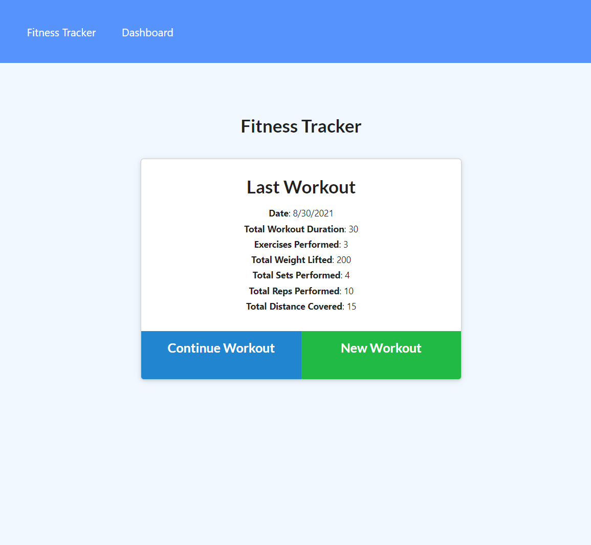

<div align="center">

# My Fitness Tracker


Built with NoSQL: MongoDB and Mongoose package

URL of the Heroku deployed application: https://pure-citadel-40908.herokuapp.com/

URL of the GitHub repository: https://github.com/rubiocode/MyFitnessTracker

</div>

## Table of Contents 

* [Description](#description)
    * [User Story](#user-story)
    * [Acceptance Criteria](#acceptance-criteria)
* [View](#view)
* [Installation](#installation)
* [Usage](#usage)
* [Built With](#built-with)
* [Future Improvements](#future-improvements)
* [License](#license)

## Description

_My Fitness Tracker_ is a simple and easy to use workout tracker to log and keep track of your daily workouts. The user is able to add multiple exercises to a workout session, complete the session for the day, or keep adding more exercises to the workout session. Then the user is able to head over to the dashboard where the user can see their workout session stats for the past seven days.  

### User Story

```md
As a user, 
I want to be able to view create and track daily workouts. 
I want to be able to log multiple exercises in a workout on a given day. 
I should also be able to track the name, type, weight, sets, reps, and duration of exercise. 
If the exercise is a cardio exercise, I should be able to track my distance traveled.
```

### Acceptance Criteria

- [x] Add exercises to most reccent workout plan. ** Click _Continue Workout_ **
- [x] Add new exercises to a new workout plan. ** Click _New Workout_ **
- [x] View the combined weight of multiple exercises from the past seven workouts on the `stats` page.
- [x] View the total duration of each workout from the past seven workouts on the `stats` page.

## View

To view the Heroku deployed webpage click [here](https://pure-citadel-40908.herokuapp.com/).

This is what the application looks like:

Landing Page: 




Dashboard Page:


## Installation 

To start using this _My Fitness Tracker_ application you must follow these instructions:

* Fork and clone this repository and save it to your computer. For help how to fork and clone click [here](https://guides.github.com/activities/forking/) 

* Download Postman to test the APIs. To download Postman click [here](https://www.postman.com/downloads/)

* Open your terminal and make sure noje.js is installed. To download node.js click [here](https://nodejs.org/en/download/)

* Run command _npm i_ to install all the dependencies in this repository. 

## Usage

_My Fitness Tracker_ application, the user can add a new workout, add exercises to an existing workout in a given day.

Click on New Workout to add a new workout, choose a type of exercise, keep adding exercises or complete workout. After a workout has been completed the user can go back and click on Contue Workout to keep adding more exercises to their active workout session. 

If you are cloning this repository, run the following commands at the root of your project:

`npm run seed` This will seed your file

`npm start` or `nodemon server.js` to start your server


## Built With

* [Express](https://expressjs.com/) - A Node.js web application server framework used to build web applications.

* [JavaScript ES6](https://www.w3schools.com/Js/js_es6.asp) - Programming language that creates dynamic website content. ES6 or ECMAScript 6 was the second major revision to JavaScript.

* [Node.js](https://nodejs.dev/learn/) - Node.js is an open-source, low-level, back-end JavaScript runtime platform that uses asynchronous programming and is a popular tool for almost any kind of project!.

* [dotenv package](https://nodejs.dev/learn/) - A package to store enviromental variables.

* [mongoose package](https://www.npmjs.com/package/mongoose) - Mongoose is a MongoDB object modeling tool designed to work in asynchronous enviroment. 

* [morgan package = dev](https://www.npmjs.com/package/morgan) - 'Dev' specific adds color to the terminal request routes. Helps makes it easier to spot broken routes in the terminal. 

* [path package](https://www.npmjs.com/package/npm-path) 

* [MongoDB](https://www.tutorialspoint.com/mongodb/index.htm) - MongoDB is a NoSQL open-source database. 


## Credits

Frontend starting files provided © 2021 Trilogy Education Services, LLC, a 2U, Inc. brand. Confidential and Proprietary. All Rights Reserved.


## License


Copyright 2021 Rubidia Rubio. Licensed under the [MIT License](https://opensource.org/licenses/MIT)

All Rights Reserved. Permission is hereby granted, free of charge, to any person obtaining a copy of this software and associated documentation files (the "Software"), to deal in the Software without restriction, including without limitation the rights to use, copy, modify, merge, publish, distribute, sublicense, and/or sell copies of the Software, and to permit persons to whom the Software is furnished to do so, subject to the following conditions:

The above copyright notice and this permission notice shall be included in all copies or substantial portions of the
Software.

THE SOFTWARE IS PROVIDED "AS IS", WITHOUT WARRANTY OF ANY KIND, EXPRESS OR IMPLIED, INCLUDING BUT NOT LIMITED TO THE
WARRANTIES OF MERCHANTABILITY, FITNESS FOR A PARTICULAR PURPOSE AND NONINFRINGEMENT. IN NO EVENT SHALL THE AUTHORS OR
COPYRIGHT HOLDERS BE LIABLE FOR ANY CLAIM, DAMAGES OR OTHER LIABILITY, WHETHER IN AN ACTION OF CONTRACT, TORT OR
OTHERWISE, ARISING FROM, OUT OF OR IN CONNECTION WITH THE SOFTWARE OR THE USE OR OTHER DEALINGS IN THE SOFTWARE.